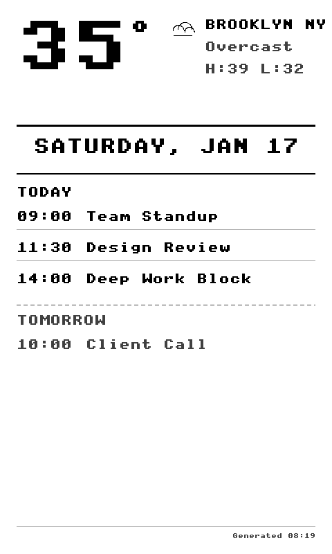

# CrossPoint Calendar

Cloudflare Worker that generates a calendar + weather display for [CrossPoint Reader](https://github.com/daveallie/crosspoint-reader) e-ink devices.

<p align="center">
  
</p>

## Features

- **Live weather** from Open-Meteo API (no API key required)
- **Google Calendar integration** with multi-day view
- **8-bit grayscale BMP** optimized for e-ink (480x800)
- **"Utilitarian Print" design** — high contrast, clear typography

## Quick Start

1. Deploy to Cloudflare Workers
2. Configure your CrossPoint Reader:
   - Settings → Calendar Server URL → `https://your-worker.workers.dev`
   - Settings → Calendar Mode → ON
3. Device fetches fresh display on each wake

## Configuration

### Environment Variables

| Variable | Required | Description |
|----------|----------|-------------|
| `DISPLAY_WIDTH` | No | Display width in pixels (default: 480) |
| `DISPLAY_HEIGHT` | No | Display height in pixels (default: 800) |
| `GOOGLE_CALENDAR_API_KEY` | No | Google Calendar API key |
| `GOOGLE_CALENDAR_ID` | No | Google Calendar ID (email or calendar ID) |

Without Google Calendar credentials, the worker displays mock calendar data.

### Setting Up Google Calendar

1. Create a project in [Google Cloud Console](https://console.cloud.google.com)
2. Enable the Google Calendar API
3. Create an API key (restrict to Calendar API)
4. Make your calendar public (Settings → Access permissions → Make available to public)
5. Set secrets via Wrangler:
   ```bash
   npx wrangler secret put GOOGLE_CALENDAR_API_KEY
   npx wrangler secret put GOOGLE_CALENDAR_ID
   ```

## Development

```bash
cd worker

# Install dependencies
npm install

# Run locally
npx wrangler dev

# Deploy
npx wrangler deploy
```

### Local Testing with Calendar

Create `.dev.vars` in the worker directory:
```
GOOGLE_CALENDAR_API_KEY=your_api_key
GOOGLE_CALENDAR_ID=your_calendar_id
```

## Architecture

```
worker/
└── src/
    └── index.ts    # Single-file worker with BMP generation
```

The worker generates BMPs entirely in-memory using a custom bitmap font renderer. No external image libraries needed.

## Related

- [CrossPoint Reader](https://github.com/daveallie/crosspoint-reader) — Open-source firmware for Xteink X4
- [Calendar Mode PR](https://github.com/crosspoint-reader/crosspoint-reader/pull/408) — Firmware support for this worker

## License

MIT

## Agent Workflow

See [AGENTS.md](./AGENTS.md) for repo-specific development and agent instructions.
